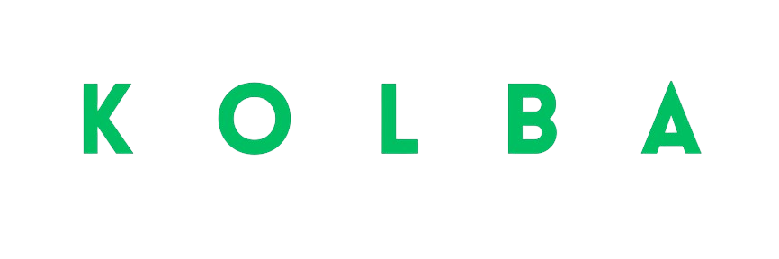

## What is Kolba

Kolba is a programming language, primarily maintained by Miralys, that allows you to convert COBOL code into TypeScript, JavaScript, Python, C#, Rust, or Kotlin.
Kolba uses COBOL syntax so that COBOL developers can easily adopt it, and the code is then compiled into a chosen modern language (TypeScript, JavaScript, Python, C#, Rust, or Kotlin).
At the same time, Kolba can also compile code back into COBOL.
Today, COBOL remains widely used, but there is a shortage of developers familiar with it. Our goal is to provide comprehensive documentation on COBOL while enabling developers skilled in modern languages to leverage COBOL technology easily.

## Packages ( Shared across Gradle, Pip, NPM, Cargo, Go.mod, etc. )

- `@kolbadev/cli`: The CLI tool for compiling COBOL code to JavaScript/TypeScript
- `@kolbadev/core`: Core library providing useful COBOL utilities and functions
- `@kolbadev/converter`: Online converter with configuration support

## Links

- [Miralys Website](https:/www.miralys.xyz/)
- [GitHub](https://github.com/Miralys-Project/Kolba)
- [Discord Server](https://discord.gg/eugCHYyeGK)
- Documentation